# DC Water Asset Management
## Project 4

## Table of Contents
  - [Project Name](#Economic Trends in Emerging Market and Developing Economies)
  - [Table of Contents](#table-of-contents)
  - [Introduction](#abstract)
  - [Prerequisites](#prerequisites)
  - [Setup and Configuration](#setup-and-configuration)
  - [Getting Started](#getting-started)
  - [Usage](#usage)
  - [Presentation](#presentation)
  - [Contributing](#contributing)
    
## Abstract
Potomac Interceptor is a pipe system, managed by DC Water, that conveys flow from various District suburban jurisdictions including Dulles Airport, Loudoun County, Fairfax County, Town of Vienna, Montgomery County, National Park Service and Navy Yard (Research Center) to the Blue Plains Advanced Wastewater Treatment Plant.

The purpose of this project is to conduct a two part analysis of structural and cost share analysis of the sewer asset management system of the Potomac Interceptor.  Using SQL, Pandas Python and machine learning tools, we are attempting to predict which pipe segments are at greatest risk of failure and would require more frequent inspections and labor. In another part we are attempting to calculate the cost share percentages of various jurisdictions at various locations.  From there we will determine how a jurisdiction’s costs might be impacted by the riskiest pipe segments.

We selected District Suburban Jurisdictions for our pipe samples. These jurisdictions span part of the Maryland/Virginia border and range into part of DC. Some of the involved counties share access to the same pipes but would not necessarily share the same responsibility and labor costs. In our analysis we will determine which jurisdictions have the highest share of pipe segments that are the most at risk and then calculate what costs would be shared by the affected jurisdictions were those pipes to fail. 

We will use Leaflet to create a map to highlight user jurisdictions and their pipe segments.  We will preprocess and filter data downloaded from Maximo (IBM Asset Management Software) and DC Water and user jurisdiction’s reports using SQL. Once the data is filtered and preprocessed, it will be downloaded as  a .csv file for use by the Pandas Python for flow, and share calculation.  Using jurisdictional flow and pipe condition data from the DC Water Report, we will use machine learning to predict the frequency of inspection cycles and risk per location. Combining this with timekeeping data from IBM Maximo we will determine the shared cost impact to the jurisdictions that we predict would be most affected by a pipe collapse.

## Prerequisites
#### Listed here are the languages and libraries required for this project:

- **SQL:** 
    (PostgreSQL with pgAdmin Download)[https://www.enterprisedb.com/downloads/postgres-postgresql-downloads]
- **Python:** 
    - This project requires Python 3.7 or later. You can download it from [python.org](https://www.python.org/downloads/).
- **Javascript:** (Leaflet)
- **Jupyter Notebook:** 
    (Documentation for Anaconda installation)[https://docs.anaconda.com/free/anaconda/install/]
- **Additional libraries:** 
    - pandas: (Documentation for Anaconda installation)[https://docs.anaconda.com/free/anaconda/install/]
    - scikit-learn: (Documentation for scikit-learn installation)[https://scikit-learn.org/stable/install.html]
    - imbalanced-learn: (Documentation for imbalanced-learn installation)[https://imbalanced-learn.org/stable/]
        - This project requires SMOTE Version 0.12.2: (SMOTE documentation)[https://imbalanced-learn.org/stable/references/generated/imblearn.over_sampling.SMOTE.html]

## Usage

### Getting Started

Clone this project's repo to your local computer:

git clone https://github.com/eaccooper5/DC_Water_Asset_Management.git 

Navigate to your project directory:

cd DC_Water_Asset_Management

#### Explanation of directories:
    1_project_ideation
        - directory of idea generation files including assignment requirements, project abstract, descriptive Power Points, and our organizational flow chart.
    2_resource
        - contains resource directories for the various working files, each directory pertaining to different areas of the project (pipe flow, labor cost, and machine learning predictions)
            - flow_data directory contains:
                - .csv files containing pipe flow data for each pipe segment jurisidiction for use in flow_share_calc.ipynb
                - excel files for SQL preprocessing
                - preprocessed SQL files
            - maximo_labor_hour
                - SQL preprocessing data for labor hour calculations
                - Maximo_download.csv for use in Inspection_labor_hour.csv
    3_codes
        - working file directory containing the primary jupyter notebooks:
            -flow_share_calc.ipynb
            -inspection_labor_hour.ipynb
            -ml_predicting risk.ipynb
        - and included JavaScript/Leaflet, CSS, and HTML files:
            -index.html
            -logic.js
            -style.css
    4_output_and_visualization
        - contains the .csv outputs to use in our visualisations and relevant image files/visualisation files.

### Steps to complete
### Setup and Configuration
SQL data retrieval. 
Upload in SQL
Join using location ID
export to .csv
import into Python pandas​
- create Leaflet map to introduce Potomac Interceptor

- explain SQL processing (flow share and labor share) to .csv to use for use in Pandas processing and machine learning prediction models.

- In pandas, flow and cost analysis used to calculate user cost share and determine the cost impact in the event of pipe collapse.
    - Analysis of Jurisdictional Flow share from: flow_share_calc.ipynb
        - Import Dependencies:
        import os
        import pandas as pd
        from pathlib import Path
        import numpy as np
        - populate data from("../2_resource/flow_data/user_flow_fy2023.csv")
                            ("../2_resource/flow_data/6.district_flow_estimate.csv")
                            ("../2_resource/flow_data/7.verification_flow.csv")
                            ("../2_resource/flow_data/8.PI_Suburban_Flow.csv")
                            ("../2_resource/flow_data/9.route_data.csv")
                            (csv_path_flow_2023, encoding="UTF-8")  
                            (csv_path_dist_flow, encoding="UTF-8")                  
                            (csv_path_verif_flow, encoding="UTF-8")

    - decribe use of Inspection_labor_hour.ipynb

        - populate dataframe from "../2_resource/maximo_labor_hour/Maximo_download.csv"
        - limit labor_hours dataframe to the following columns: "route", "location_id", "work_date", "mjuf_code", and "labor_hour"
        - calculate the total labor hours required per route
        - calculate the average hourly cost per route

- flow and pipe condition data preprocessed to populate risk prediction machine learning model.

- results from data processing and machine learning used to make visualisations in Tableau

### Data Retrieval and Processing

#### Introduction
DC Water asset, the Potomac Interceptor, is a 50 mile long series of pipes that brings water to 1.6 million people from Fairfax, VA to parts of DC and Mongomery County, MD. When a pipe segment is damaged or degrades to the point that it is no longer safe it can be expensive to repair and the costs of those repairs might be shared between jurisdictions depending on whether or not that pipe segment shares territor with a neighbor. Our project took a look at Patomac Interceptor pipe system in order to predict risk to critial water assets and determine the cost impact to various user jurisdictions.

As pictured in the flow chart below, we used SQL to join labor data from IBM Maximo and water flow data from the DC Water Report to calculate flow per user labor hours per location. We then exported that data for use in our cost and flow share analysis and our machine learning risk prediction model per location and created vizualiztions in Tableau.

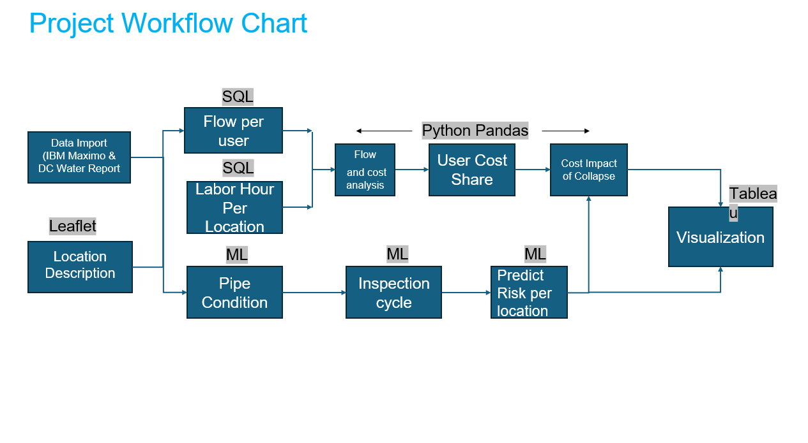

We also produced a Leaflet map of the manholes serving each pipe segment with popups displaying each segment's coordinates as well as the length, slope, and pipe diameter over the entire selected water flow route.

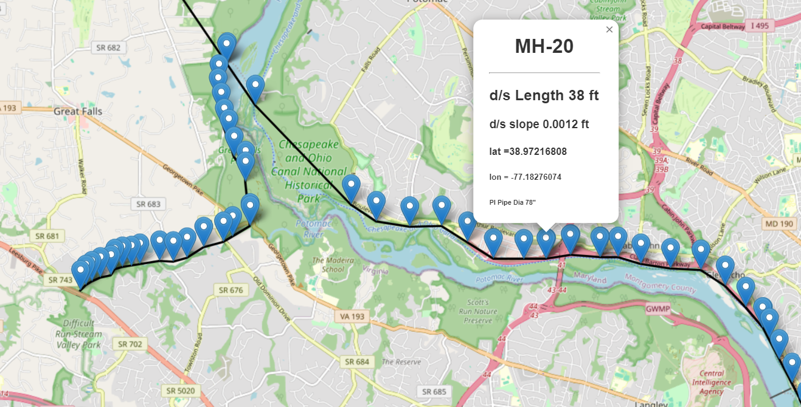

And the following chart lays out where each jurisdiction meets up along the length of the Potomac Interceptor's route, starting in Dulles and branching into Herndon, Montgomery County, MD, and into the District and what manholes specifically delineate those borders. Each branch is numbered. These are the primary flow divisions in our data and will be used to calculate cost and flow share and the pipe inspection data will be used to populate our risk prediction model.

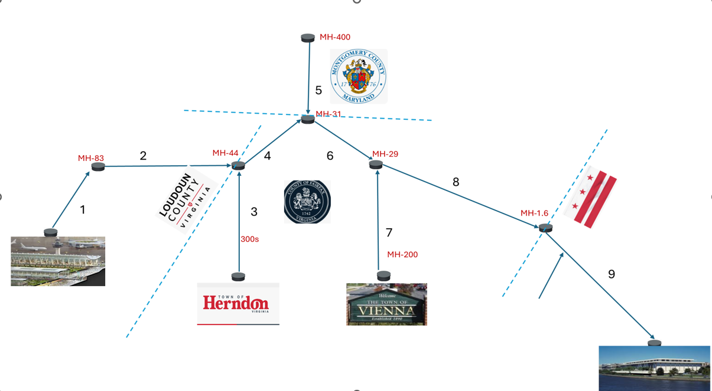

#### Risk Prediction (Machine Learning)
Using supervised machine learning, we used the data from our Inspectionlist3.csv file, separating our 'risk score' from the other features which included: 
- Seg_ID (ID of each pipe segement)
- UP_MH (upstream manhole)
- DS_MH (downstream manhole)
- Dia_Inch (pipe diameter in inches)
- Shape (pipe shape)
- Material (the material each pipe segment was constructed from)
- Length_Ft (pipe length in feet)
- MWL (mean water level)
- DS (deposit settled)
- defects (note of any damage to pipe structure)
- Video Quality (quality of the investigative footage of pipe structure)
- Jurisdiction (which jurisdiction (city, county or district) the pipe segement belonged to)
- Inspection_cycle (how often inspections were required for compromised pipes)
- route (the route of water flow)

We used 'risk score' to populate our variable 'y' and the features listed above to populate our features variable, 'X.'

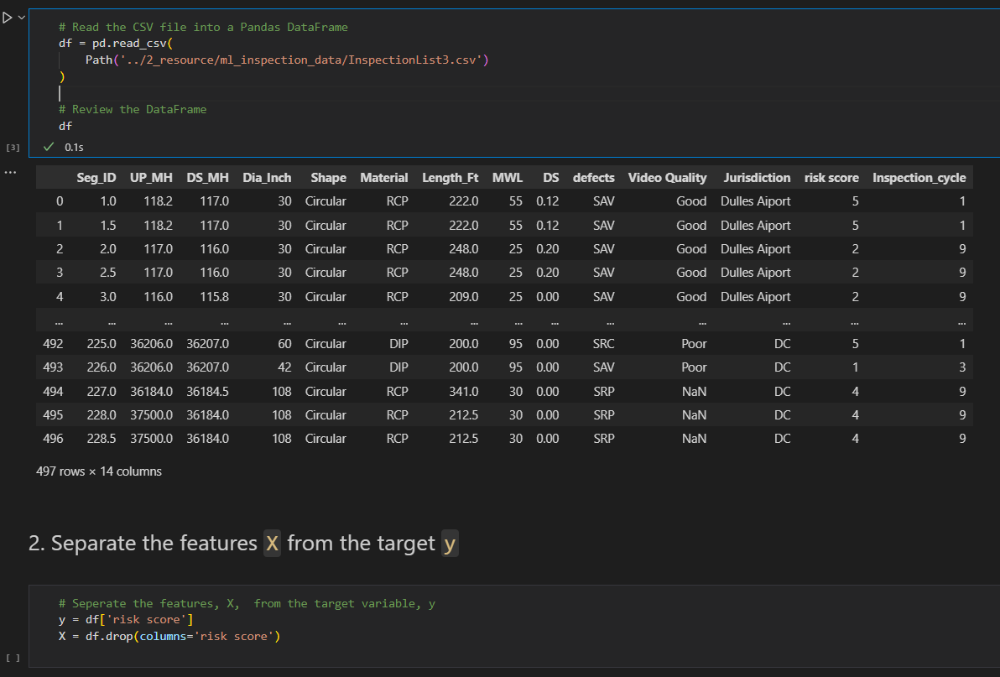

Then encoded our categorical variables with pd.get_dummies() and split our data into training and testing sets.

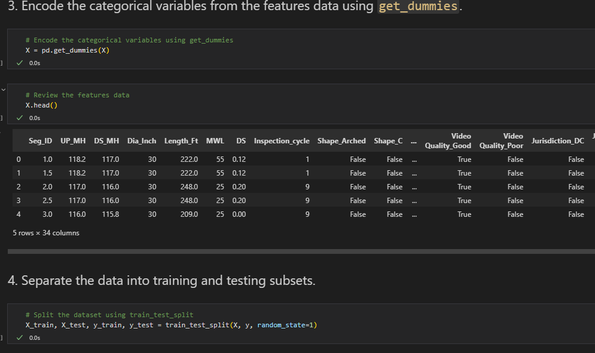

We then used the StandardScaler() to scale our data to fit the model and used the KNeighborClassifier() where the number of neighbors was =3 to train our model and fit our model based on the training data.

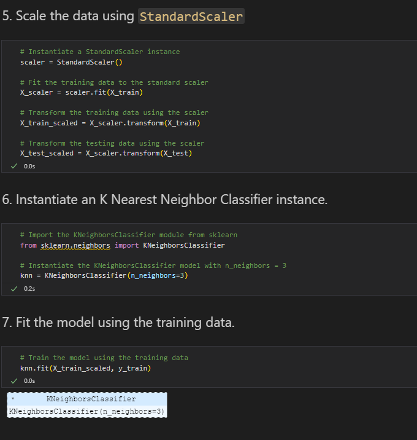

Prediction and Classification Report: describe low accuracy and fi-scores.

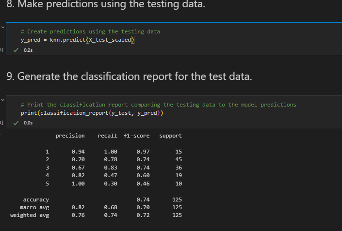

With our initial prediction model looking we, we resampled our data using imbalanced learning SMOTE (Synthetic Minority Oversampling Technique) to "create new(artificial) training examples based on the original training examples"(Altaf Khan from [link] quora.com) and reran our classification report. This yielded better results with greater precision and recall scores. Our accuracy scores also improved from 0.62 to 0.78 and where we'd had fi-scores as low as 0.45, our lowest was now 0.65.

[image here]

We then ran our confusion matrix for this resampled model which did show some noise but was more accuracte than our previous.

[image here]

Further steps: For better risk prediction models we could use more statistical data and be more selective about features used in the model. If 'Video Quality' does not factor into pipe condidition it may not be necessary to consider it in future risk prediction models. We could also run other configurations for future imbalanced learning models to see if any of those yield more favorable results.

#### Flow Share Calculation (with SQL and Python Pandas):
We took our data from several sources. For labour hours per distinct job we used time keeping data from IBM Maximo. We also used the each user jurisdiction's Flow Report, the DC Water Asset Database, and took our pipe inspection data from consultant and contractor reports.

We preprocessed and filtered the data by first uploading it into SQL and joining tables using "location ID." Then we exported that data to .csv and imported it into Python Pandas for further processing.

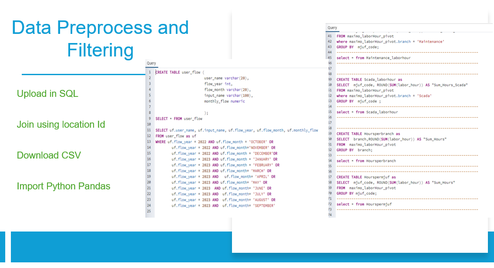

District Flow data includes:
- user (jurisidation)
- flow_route
- Flow_length
- flow_route_name
- sewersheds
- pop (resident population)
- emp (employee population)
- visitor (tourist population)
- area_acres
- infilt_InchMile (area of infiltration)
- Infil_mgdinchMile (rate of infiltration)
- infil_MGD (water from )
- pro_infiltration_rate (prorated inflitration rate)
- storm_mgd (from rain to pipe)
- sanitary_mgd (waste water)
- high_user_mgd (big business/corperations (million gallon per day))
- ground_water_pumpage (ground water pumped into pipe system)
- total_annual_flow
- billing_dc_flow
- impervious__acres (concrete, etc.)
- pervious_acres (grass, soil, etc.)
- pipe_surface_area_acres

For our flow share data, we began with our district_flow_est.csv file which contained data for the above columns. Describe calculations for District Flow.

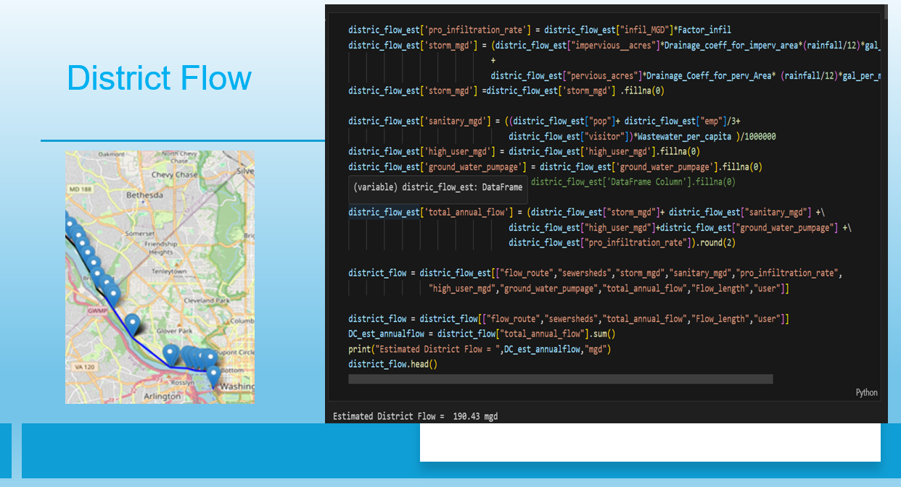

Explain billing flow report per jurisdiction.

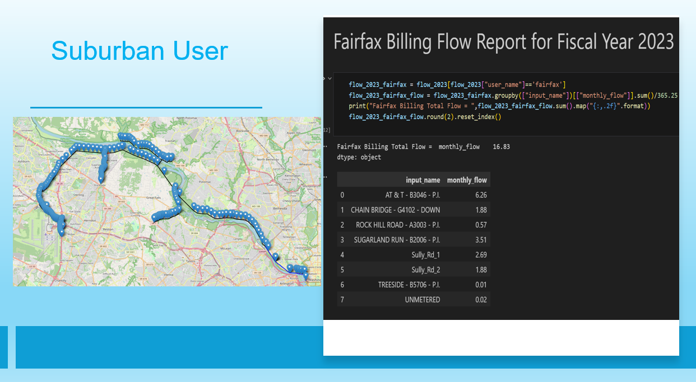

Lead into Flow Share calculations per jurisdiction.

[take screenshot of output_Length calculation for use in route flow calculations]

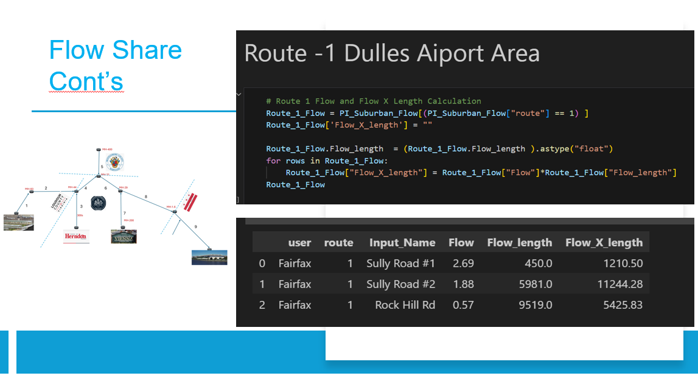
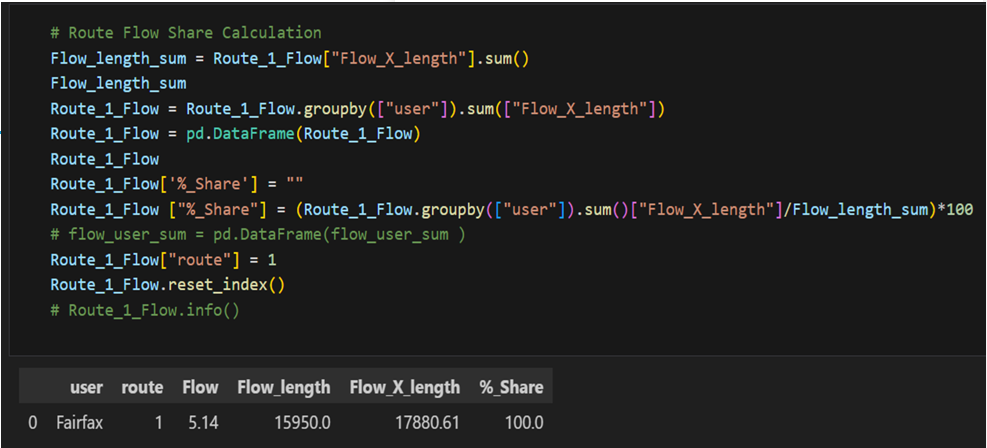
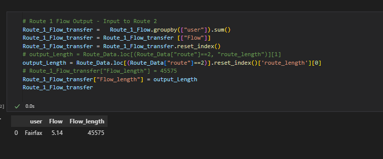

overview of data, 

approach to goals, 

conclusions, and 

next steps

### Data Visualization

## Contributing 
This project was created for learning purposes and is not currently open for contribution.

## Authors and acknowledgement
Eyasu Yilma and Erin Cooper

### Notes and Challenges

## Contact
For questions about this project:
##### [email: erinaccooper@gmail.com](mailto:erinaccooper@gmail.com)
##### [email: eyasu.yilma@gmail.com](mailto:eyasu.yilma@gmail.com)